# 🎨 Artistplanner 🗓️

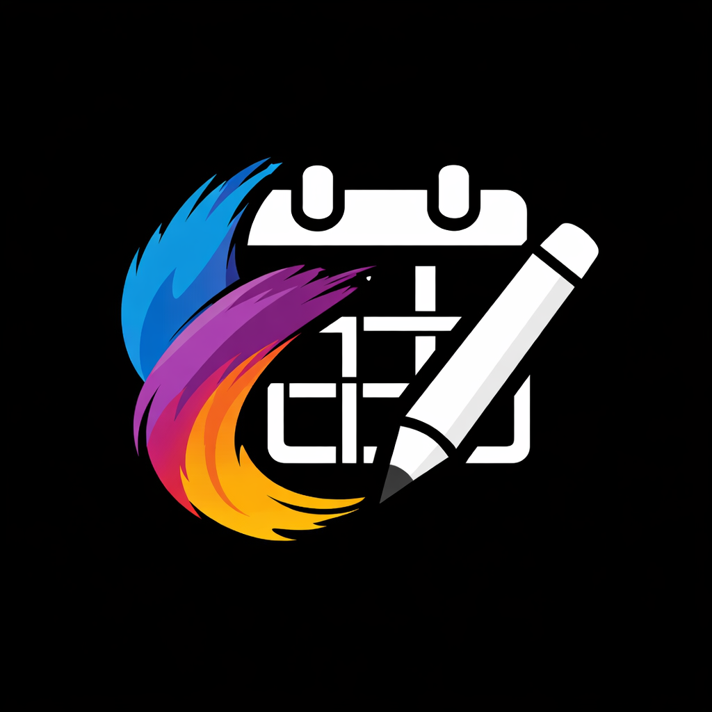

![coverage][coverage_badge]
[![style: very good analysis][very_good_analysis_badge]][very_good_analysis_link]
[![License: MIT][license_badge]][license_link]

Daily Personal Tracking Routing & Emotion with Monthly Goals.

## Description

**2nd** 2026 personal project inspire ✨ by from artist planner book 📕

## ⏰ Working application

<table>
  <tr>
    <th>Page</th>
    <th>Khmer</th>
    <th>English</th>
  </tr>
  <tr>
    <td><strong>Dashboard</strong></td>
    <td>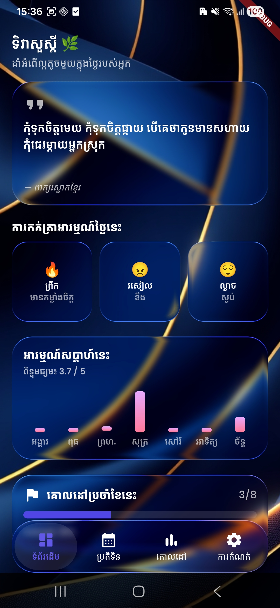</td>
    <td>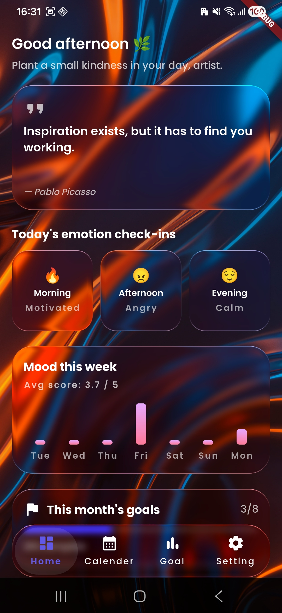</td>
  </tr>
  <tr>
    <td><strong>Calender</strong></td>
    <td>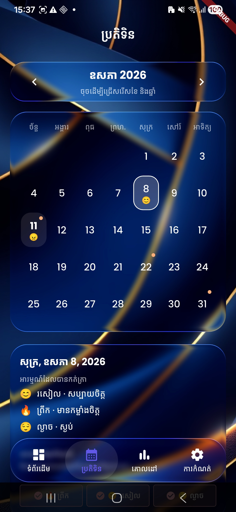</td>
    <td>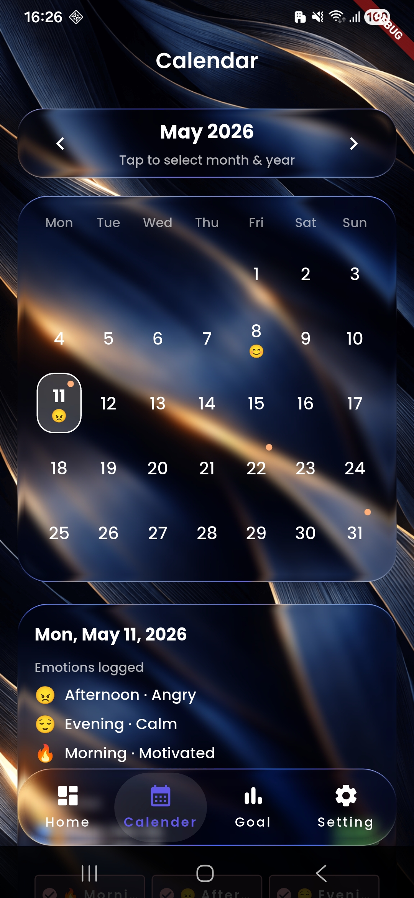</td>
  </tr>
  <tr>
    <td><strong>Goal</strong></td>
    <td>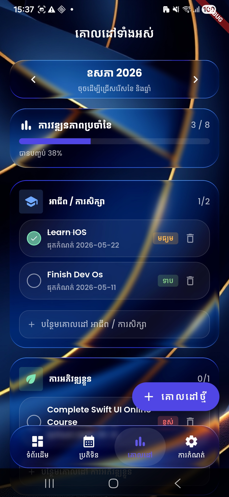</td>
    <td>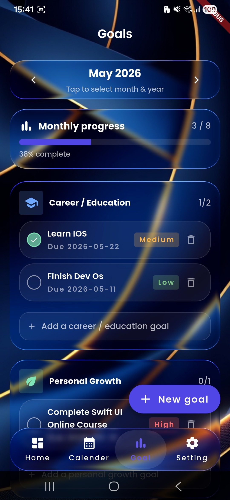</td>
  </tr>
  <tr>
    <td><strong>Setting</strong></td>
    <td>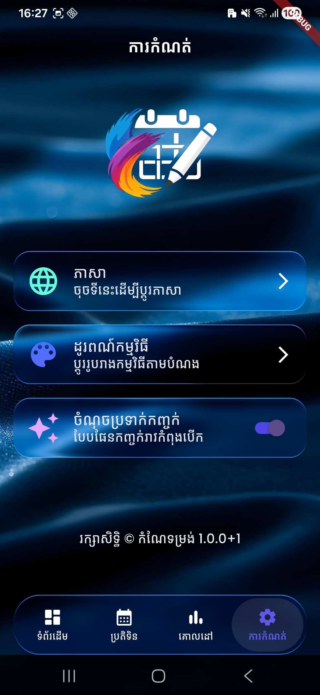</td>
    <td>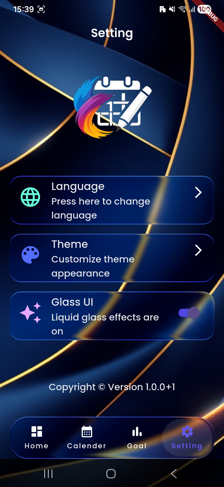</td>
  </tr>
  <tr>
    <td><strong>Create Goal</strong></td>
    <td>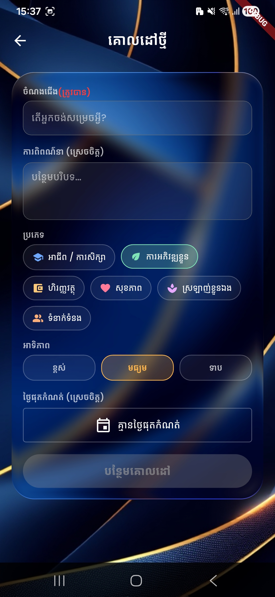</td>
    <td>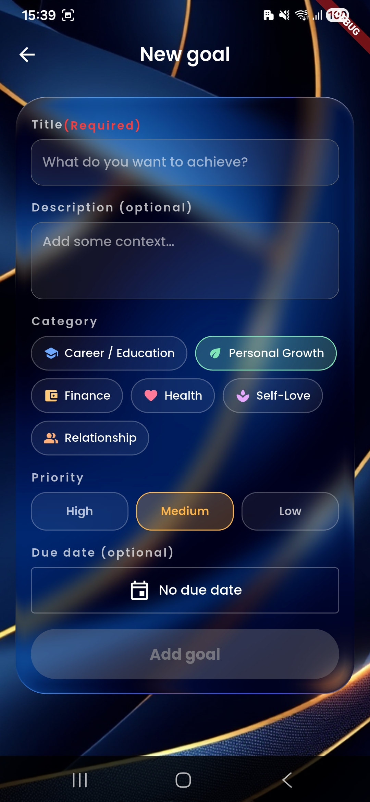</td>
  </tr>
  <tr>
    <td><strong>Edit Goal</strong></td>
    <td>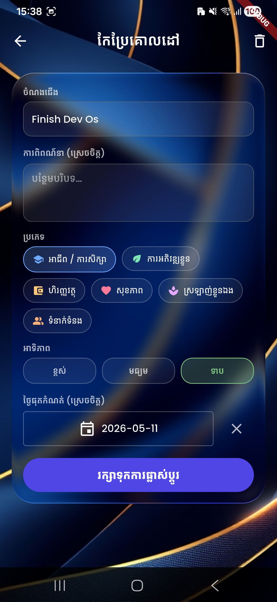</td>
    <td>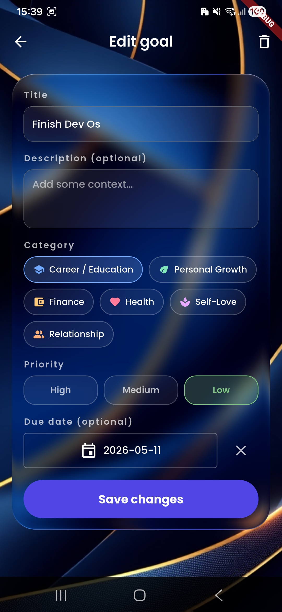</td>
  </tr>
  <tr>
    <td><strong>Pick Date</strong></td>
    <td>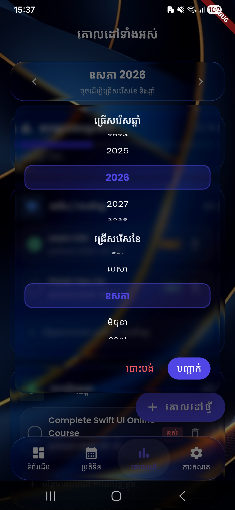</td>
    <td>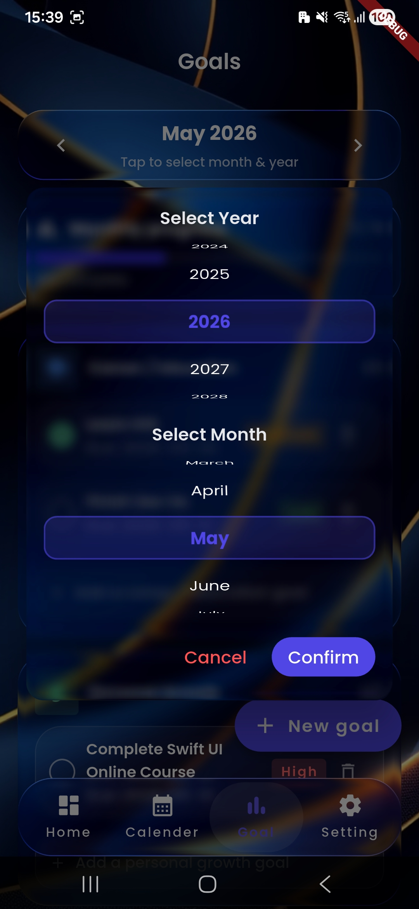</td>
  </tr>
  <tr>
    <td><strong>Daily Emotion</strong></td>
    <td>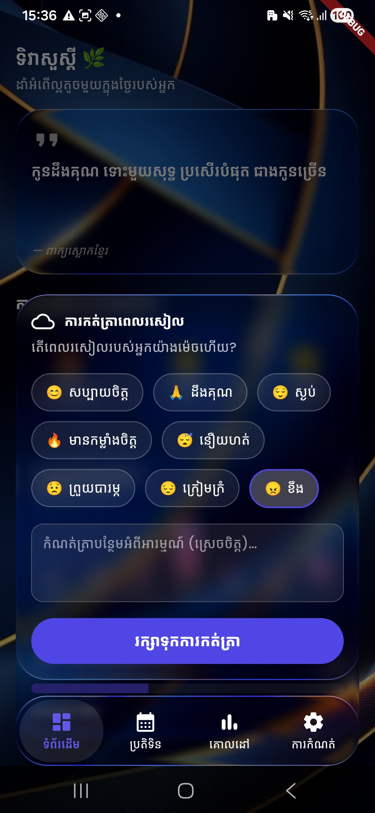</td>
    <td>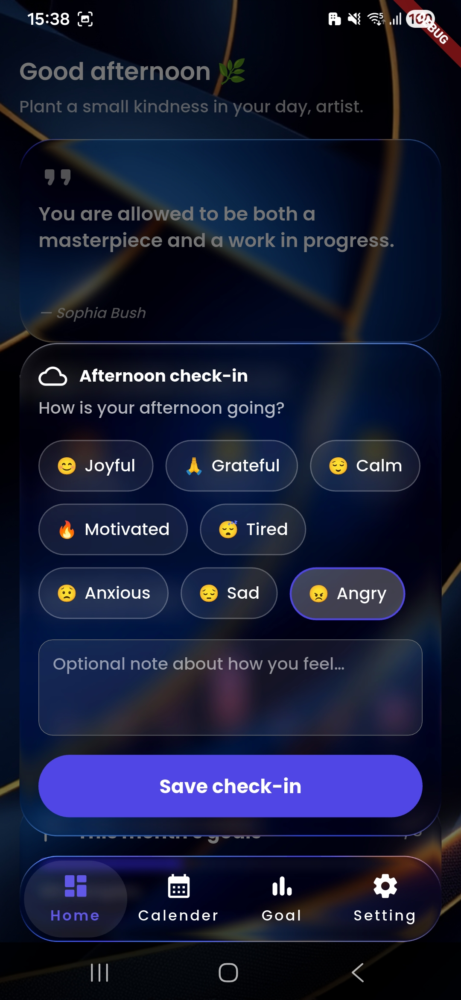</td>
  </tr>
</table>

---

## Using FVM 🧠

- fvm stable version : 3.41.9

---

## Getting Started 🚀

This project contains 3 flavors:

- development
- staging
- production

To run the desired flavor either use the launch configuration in VSCode/Android Studio or use the following commands:

```sh
# Development
$ fvm flutter run --flavor development --target lib/main_development.dart

# Staging
$ fvm flutter run --flavor staging --target lib/main_staging.dart

# Production
$ fvm flutter run --flavor production --target lib/main_production.dart
```

_\*Artistplanner works on iOS and Android._

---

### Generating Translations

To use the latest translations changes, you will need to generate them:

1. Generate localizations for the current project:

```sh
fvm flutter gen-l10n
```

Alternatively, run `fvm flutter run` and code generation will take place automatically.

[coverage_badge]: coverage_badge.svg
[license_badge]: https://img.shields.io/badge/license-MIT-blue.svg
[license_link]: https://opensource.org/licenses/MIT
[very_good_analysis_badge]: https://img.shields.io/badge/style-very_good_analysis-B22C89.svg
[very_good_analysis_link]: https://pub.dev/packages/very_good_analysis
